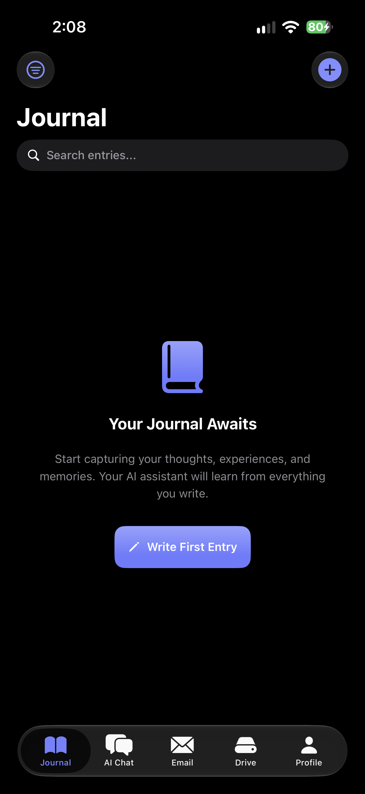
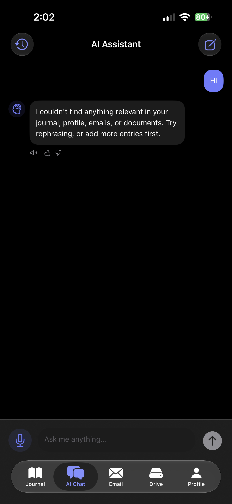
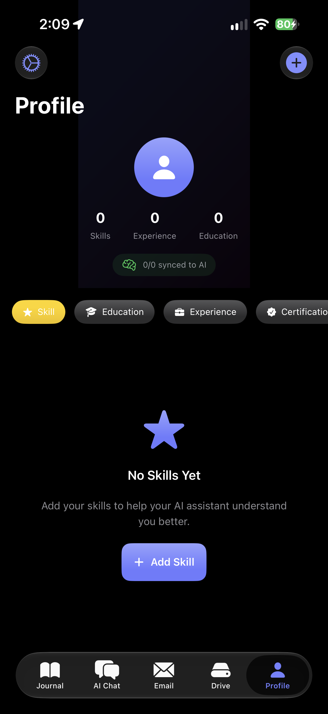
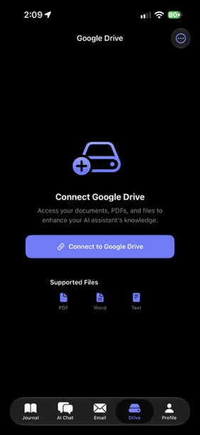
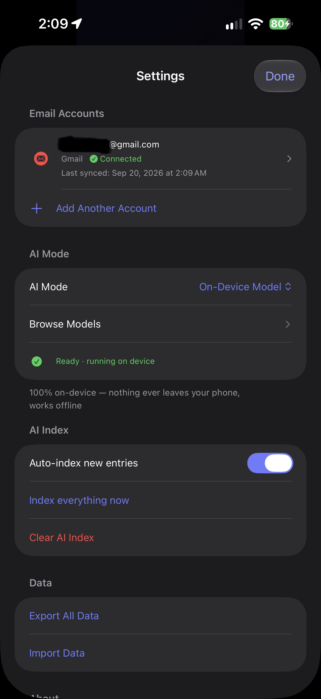
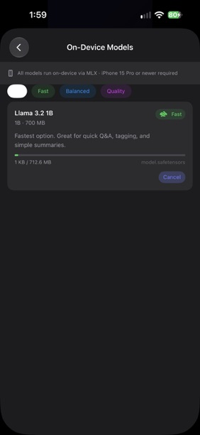
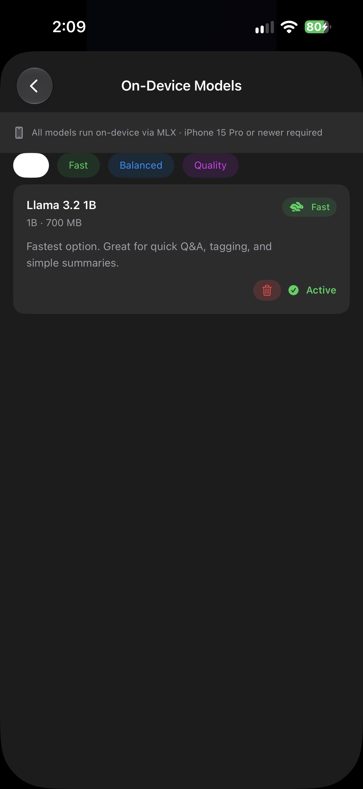
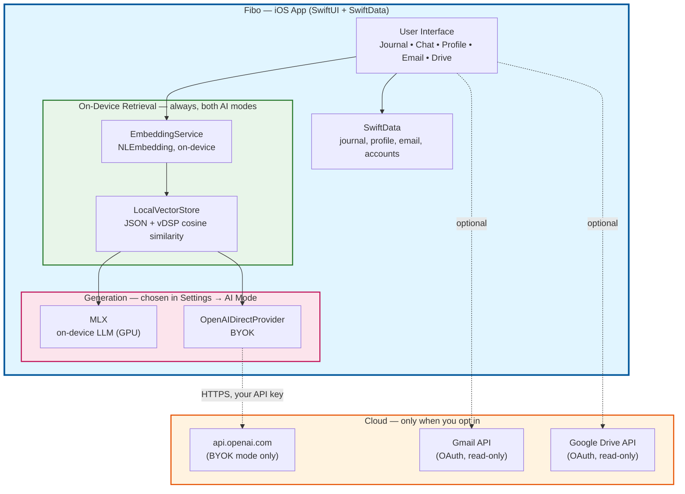
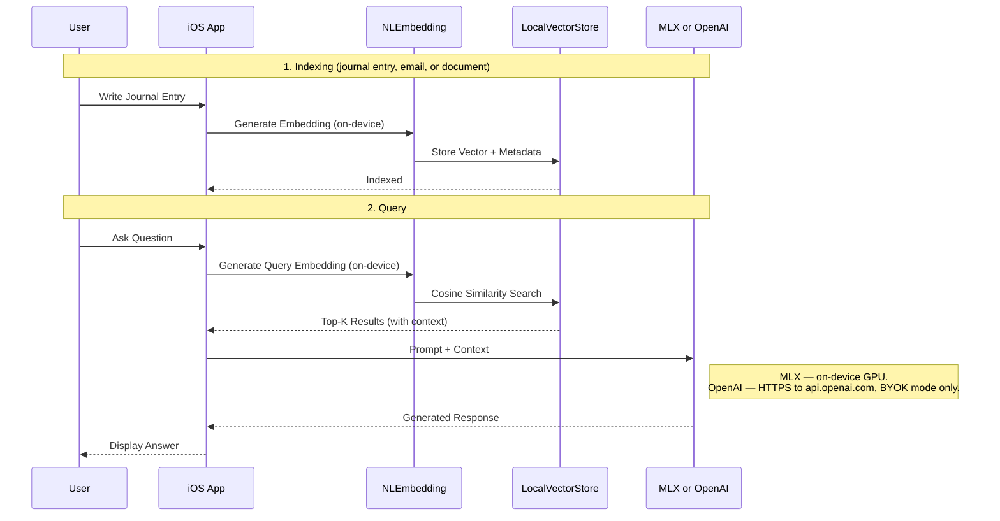
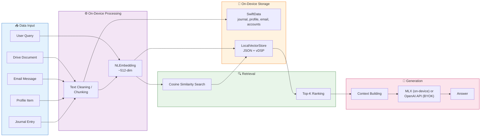

# Fibo 🧠

A 100% local, AI-powered iOS journal assistant that remembers everything about you with complete privacy. Write journal entries, record your skills, education, and experiences, and let your AI assistant answer questions about your life — running entirely on-device with zero server calls and zero external storage, ensuring complete privacy for your personal data.

## Features

- 📝 **Personal Journal**: Write daily entries with categories, tags, and mood tracking
- 👤 **Profile Builder**: Record your skills, education, work experience, certifications, and more
- 🤖 **AI Chat**: Ask questions about your life, and get answers based on your journal
- 🎤 **Voice Support**: Speak your thoughts and have AI responses read aloud — dictation is always on-device, in both AI modes
- 📧 **Email Integration**: Connect Gmail, sync messages, and ask the AI about them in Chat (configurable in-app)
- 🔍 **RAG-Powered**: Retrieval-Augmented Generation — on-device embedding and vector search surface relevant context before the model answers
- 🔒 **Privacy by design**: No self-hosted backend, no server Fibo operates. Retrieval always runs on your phone; the only thing that ever leaves it is your question, and only if you choose BYOK
- 📱 **Runs standalone**: No Mac, no Docker, no server — the whole pipeline fits on the iPhone itself

## Screenshots

<table>
  <tr>
    <td align="center"><br/>Journal</td>
    <td align="center"><br/>AI Chat</td>
    <td align="center"><br/>Profile</td>
    <td align="center"><br/>Google Drive</td>
  </tr>
  <tr>
    <td align="center"><br/>Settings — AI Mode</td>
    <td align="center"><br/>Browse Models — downloading</td>
    <td align="center"><br/>Browse Models — active</td>
    <td></td>
  </tr>
</table>

## AI Modes

Pick a mode in **Profile → Settings → AI Mode**. There is no self-hosted backend and never
will be — Fibo doesn't host infrastructure for you. Retrieval (embedding + vector search)
always happens on-device in both modes; only generation differs:

| Mode | Retrieval | Generation | Leaves the device? |
|---|---|---|---|
| **On-Device** | `NLEmbedding` + `LocalVectorStore`, on-device | MLX running on the iPhone's GPU | **Never** |
| **OpenAI (BYOK)** | `NLEmbedding` + `LocalVectorStore`, on-device | OpenAI API, called directly from the phone with your key | Only your question + retrieved context, to OpenAI |

BYOK exists for people who want faster or more capable responses and are comfortable trading
some privacy for it — that's a choice you make per-query-session, not something the app decides
for you.

### On-Device mode

Everything runs on the phone:

- **Embeddings** — Apple's built-in `NLEmbedding.sentenceEmbedding`. No download, no network.
- **Vector search** — `LocalVectorStore`, a JSON-backed store with `vDSP` cosine similarity.
- **Generation** — [MLX](https://github.com/ml-explore/mlx-swift-lm) running a 4-bit quantized model on the GPU.
- **Dictation** — forced to on-device speech recognition, so audio is never uploaded.

Download models in-app from **Settings → AI Mode → Browse Models**. Curated options,
all verified to fit an iPhone 16 Plus (A18, 8 GB RAM):

| Model | Size | Tier |
|---|---|---|
| Llama 3.2 1B | ~0.7 GB | Fast |
| Gemma 3 1B | ~0.8 GB | Fast |
| **Llama 3.2 3B** | ~1.8 GB | **Balanced — recommended** |
| Qwen 2.5 3B | ~1.9 GB | Balanced |
| Phi 3.5 Mini | ~2.2 GB | Balanced |
| Gemma 3 4B | ~2.5 GB | Balanced |
| Mistral 7B | ~4.1 GB | Quality |

**One-time Xcode setup to enable on-device generation** — two packages, both via
**File → Add Package Dependencies…**:

1. `https://github.com/ml-explore/mlx-swift-lm` (Up to Next Major, from `3.31.3`)
   → add **MLXLLM**, **MLXLMCommon**, and **MLXHuggingFace** to the Fibo target
2. `https://github.com/huggingface/swift-transformers` (Up to Next Major, from `1.3.4`)
   → add **Tokenizers** to the Fibo target

The second package is easy to miss: mlx-swift-lm's tokenizer loader expands to code
that calls into `swift-transformers` directly, but mlx-swift-lm doesn't declare it as
a package dependency — Xcode won't pull it in for you.

**⚠️ Both MLX and NLEmbedding need a physical device — the Simulator can't run either.**
MLX requires a Metal `MTLGPUFamily` the Simulator doesn't provide; trying anyway fails
with `failed assertion 'Dispatch Threads with Non-Uniform Threadgroup Size is not
supported on this device'`. Separately, `NLEmbedding.sentenceEmbedding` — the retrieval
embedding used in *both* AI modes — reliably returns `nil` in the Simulator even though
the exact same code works on real hardware; Fibo surfaces this as "On-device
sentence embedding model is not available on this device." Both are platform
limitations, not bugs in this code. Options:
- Run on a physical iPhone (A17 Pro or newer for good MLX performance; any iOS 17+
  device works for NLEmbedding/BYOK)
- Add the **"Mac (Designed for iPad)"** destination in Xcode and run there instead —
  Apple Silicon Macs have a full Metal GPU and NLEmbedding works there too
- Everything that doesn't touch embedding or MLX generation (journal/profile editing,
  email/Drive account management, BYOK key entry) works fine in the Simulator; anything
  that indexes or searches content, or generates on-device, needs real hardware

**Memory:** iOS kills apps that use too much RAM ([jetsam](https://developer.apple.com/documentation/xcode/identifying-high-memory-use-with-jetsam-event-reports)).
The larger catalog models (Gemma 3 4B, Mistral 7B) may need the
[Increased Memory Limit entitlement](https://developer.apple.com/documentation/bundleresources/entitlements/com_apple_developer_kernel_increased-memory-limit)
(Xcode → target → Signing & Capabilities → **+ Capability** → "Increased Memory Limit")
to avoid termination on devices where RAM would otherwise allow it. Not required for the
Fast-tier models (~0.7–0.8 GB).

Requires **Xcode 26+** (mlx-swift-lm is swift-tools-version 6.2) and iOS 17+. An A17 Pro
or newer device is recommended — inference runs on the GPU via Metal. Until both packages
are linked, the app builds and runs normally and On-Device mode reports that generation
isn't available yet.

> Google Drive documents: Fibo indexes PDFs, Google Docs, and text files on-device using
> PDFKit. `.docx` / `.pptx` aren't supported — there's no backend to parse them.

## Architecture



There is no backend and no server Fibo hosts for you. Everything under "iOS App" runs
inside the app process on the phone. The only network calls the app ever makes are: (1) OpenAI's
API, only in BYOK mode, only with your own key; (2) Hugging Face, only when you tap Download on a
model in Browse Models; (3) Google OAuth/Gmail/Drive, only if you connect those integrations.

### RAG Pipeline Flow



### Data Flow Architecture



## Prerequisites

- **Xcode 15+**, iOS 17+ deployment target
- **Xcode 26+** and a physical iPhone (A17 Pro+ recommended) if you want On-Device generation —
  see [On-Device mode](#on-device-mode) for why
- Nothing else. No Python, no Docker, no server to run — the app builds and runs standalone

## Quick Start

```bash
git clone <repo-url>
cd Fibo
open Fibo.xcodeproj
```

Then in Xcode: select a device or simulator, and build & run (⌘R).

**First launch:** the app defaults to **On-Device** mode. Go to **Profile → Settings → AI Mode
→ Browse Models** to download a model (Llama 3.2 3B is the recommended default) — see
[On-Device mode](#on-device-mode) above for the one-time Xcode package setup that enables
generation. Prefer **OpenAI (BYOK)** instead? Switch AI Mode and paste your API key; no
Xcode setup needed for that path.

**Optional — Gmail/Drive integration:**
```bash
cp Config.local.xcconfig.example Config.local.xcconfig
# then set GOOGLE_OAUTH_CLIENT_ID_PREFIX — see docs/ENABLING_EMAIL_FEATURES.md
```
Skip this and the app runs fine with those integrations disabled.

## Project Structure

```
Fibo/
├── Fibo/                    # iOS App — this is the whole product
│   ├── FiboApp.swift        # App entry point
│   ├── ContentView.swift         # Main content view
│   ├── Models/                   # SwiftData models
│   │   ├── JournalEntry.swift
│   │   ├── ProfileItem.swift
│   │   └── ChatMessage.swift
│   ├── Views/                    # SwiftUI views
│   │   ├── Journal/
│   │   ├── Chat/
│   │   └── Profile/
│   │       ├── ProfileView.swift        # Includes SettingsView (AI Mode)
│   │       └── ModelBrowserView.swift   # Download/select on-device models
│   ├── Services/
│   │   ├── EmbeddingService.swift       # On-device embeddings (NLEmbedding)
│   │   ├── VectorDBService.swift        # Wraps LocalVectorStore: embed + upsert/search
│   │   ├── LocalVectorStore.swift       # On-device vectors + vDSP search
│   │   ├── LLMProvider.swift            # OpenAI (BYOK) / MLX (on-device) providers
│   │   ├── ModelCatalog.swift           # Model catalog + Hugging Face downloader
│   │   ├── LLMService.swift             # Resolves the active provider from AI Mode
│   │   └── RAGService.swift             # Retrieval + generation orchestration
│   └── Utilities/
│       └── Configuration.swift
│
└── mcp-server/                   # Standalone MCP server (Google Drive tools)
    └── src/index.ts              # Not used by the iOS app — DriveService.swift talks to
                                   # Google Drive directly. This exposes the same capability
                                   # as MCP tools for use from an MCP client (e.g. Claude
                                   # Desktop) instead.
```

## Configuration

### iOS App Settings

Navigate to Profile → Settings in the app to configure:

- **AI Mode**: On-Device / OpenAI (BYOK) — see [AI Modes](#ai-modes) above
- **OpenAI API Key**: Stored in the iOS Keychain, never in UserDefaults (BYOK mode)
- **Browse Models**: Download and select on-device MLX models (On-Device mode)
- **Auto-sync**: Automatically sync new entries to AI
- **Sync All Now / Clear AI Data**: Re-index or wipe the search index (journal entries themselves are untouched)
- **Email Accounts**: Connect Gmail with one tap
  - Users just click "Connect Gmail Account" and authorize
  - Emails are automatically synced and indexed on-device for Chat context
  - No manual configuration needed by users

**Developer Setup (One-time):**
The Google OAuth client ID is a build setting, not something hardcoded in source — see
[docs/ENABLING_EMAIL_FEATURES.md](docs/ENABLING_EMAIL_FEATURES.md) for the 5-minute version, or
[docs/EMAIL_CONFIGURATION_GUIDE.md](docs/EMAIL_CONFIGURATION_GUIDE.md) for the full walkthrough:
1. [Google Cloud Console](https://console.cloud.google.com/apis/credentials) → create project →
   enable Gmail API → create an iOS OAuth Client ID
2. `cp Config.local.xcconfig.example Config.local.xcconfig` and set `GOOGLE_OAUTH_CLIENT_ID`
   there (gitignored — never committed)
3. Users can then connect their Gmail accounts seamlessly, no source changes needed

## Usage Examples

### Adding Journal Entries

1. Tap the **+** button in the Journal tab
2. Write your entry (or use voice input)
3. Select a category and add tags
4. Optionally track your mood
5. Save - the entry will be automatically synced to AI

### Asking Questions

Try questions like:
- "What are my top skills?"
- "Summarize my career journey"
- "What were my goals this year?"
- "Am I qualified for a senior developer role?"
- "What patterns do you see in my journal?"

### Building Your Profile

Add comprehensive profile items:
- **Skills**: Programming languages, tools, soft skills
- **Education**: Degrees, certifications, bootcamps
- **Experience**: Jobs, roles, responsibilities
- **Projects**: Personal and professional projects
- **Achievements**: Awards, milestones, accomplishments

## Development

### Running Tests

```bash
# iOS: no test target exists yet (Fibo.xcodeproj has a single
# PBXNativeTarget, the app itself). Verify iOS changes by building and
# running in Xcode.
```

### Running the MCP Server

Optional — the iOS app doesn't use this; it exposes the same Google Drive capability as
`DriveService.swift` for use from an MCP client instead.

```bash
cd mcp-server
npm install
npm run build   # tsc — this is what CI runs
npm start        # or: npm run dev  (tsx watch)
```

## Privacy & Security

- No self-hosted backend, no server Fibo operates — there's nothing to trust beyond
  the app itself, Apple's frameworks, and whichever cloud API you explicitly opt into
- API keys are stored securely in iOS Keychain and never logged
- Email OAuth tokens are hardware-encrypted in Keychain
- Dictation always uses on-device speech recognition, in both AI modes — Fibo refuses
  to fall back to Apple's servers rather than silently uploading audio

What leaves the device depends on the AI mode:

- **On-Device** — nothing. Embedding, search, and generation all run on the phone.
- **OpenAI (BYOK)** — your question and the retrieved context are sent to OpenAI to generate
  each answer. Retrieval itself (embedding, search) still runs on-device — only that one
  generation call leaves the phone, and only because you chose BYOK.

## Documentation

For detailed guides, see the `docs/` folder:

- **[QUICK_START.md](QUICK_START.md)** - Quick reference for common tasks and troubleshooting
- **[EMAIL_CONFIGURATION_GUIDE.md](docs/EMAIL_CONFIGURATION_GUIDE.md)** - Step-by-step Gmail integration setup
- **[ENABLING_EMAIL_FEATURES.md](docs/ENABLING_EMAIL_FEATURES.md)** - How to enable email features (5 minutes)

## Roadmap

### Completed ✅
- [x] Voice input and output (Speech-to-text & Text-to-speech)
- [x] Email integration (Gmail OAuth, in-app configuration)
- [x] Secure credential storage (iOS Keychain)
- [x] BYOK mode (bring your own OpenAI key)
- [x] On-device embeddings (`NLEmbedding`)
- [x] On-device vector store (vDSP cosine similarity)
- [x] On-device LLM generation (MLX) with in-app model downloads
- [x] Fully standalone — no backend, no server, no Mac required

### Coming Soon
- [ ] iCloud sync for journal entries
- [ ] Apple Watch companion app
- [ ] Siri integration
- [ ] Export/import functionality
- [ ] Multiple AI personas
- [ ] Advanced analytics and insights
- [ ] Email auto-summarization
- [ ] Background email sync

## License

MIT License - see [LICENSE](LICENSE) for details.

## Contributing

Contributions are welcome! Please read our contributing guidelines and submit pull requests.

---

Built with ❤️ using SwiftUI, SwiftData, and MLX
